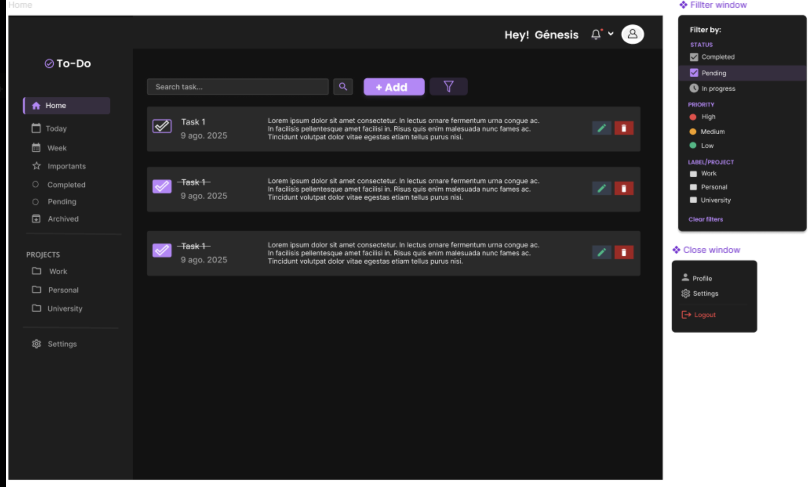

🎨 Figma Design Ideas

    User Interface Pages:
        Login/Sign-Up Page: Clean and simple form with Ant Design components.
        Dashboard: Display an overview of all projects, tasks, and notifications.
        Project Page: List all tasks in a project with filtering and sorting options.
        Task Details Modal: Show task details with edit/delete options.

    Color Palette:
        Use a professional color scheme (e.g., blue, white, and gray for light mode; dark blue and black for dark mode).

    Typography:
        Use Ant Design's typography components for consistency.

    Responsive Design:
        Create mockups for web and mobile views.

[UI Figma Link](https://www.figma.com/design/cLtmwFLgJHuaHdU5i5MmgW/TODO-APP?node-id=0-1&p=f&t=irrNrPrCPQ2IvNrs-0)

